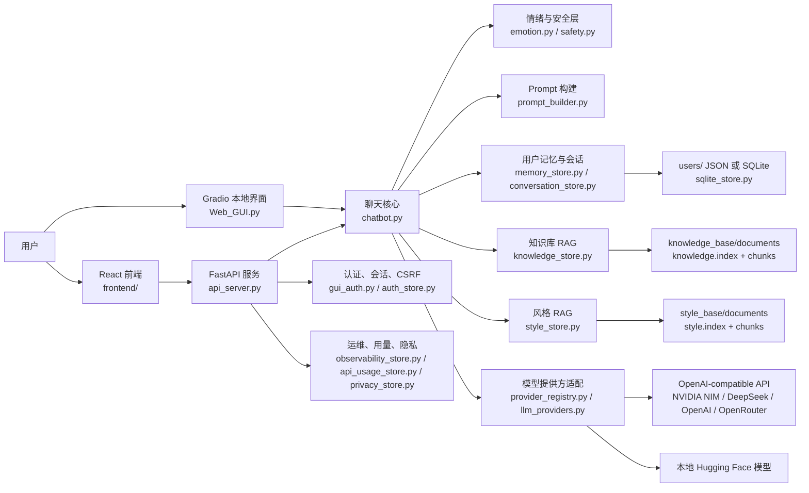

# Serenova

[English README](README.md)

Serenova 是一个带情绪感知、长期记忆、知识库 RAG 和风格参考 RAG 的聊天机器人项目。项目包含三个主要入口：

- `Web_GUI.py`：本地 Gradio 图形界面
- `api_server.py`：FastAPI HTTP API
- `frontend/`：React/Vite 前端

系统可以使用 OpenAI-compatible API 服务，也可以使用本地 Hugging Face 模型。它会结合情绪分析、安全判断、用户记忆、会话归档、Mood check-in、知识检索和风格检索来生成回复。

## 在线网站

部署后的网站地址：

[https://chat.serenova.dev](https://chat.serenova.dev)

## 系统架构



React 前端和 FastAPI 是公开网站的主要路径；Gradio GUI 适合本地使用。两条聊天路径最终都会进入 `chatbot.py`，由它整合情绪/安全判断、用户记忆、可选知识库 RAG、可选风格 RAG，再通过 `llm_providers.py` 调用远程 API 或本地 Hugging Face 模型生成流式回复。

## 项目结构

```text
.
|-- api_server.py              # FastAPI 适配层和 /api/v1 路由
|-- Web_GUI.py                 # Gradio 图形界面
|-- chatbot.py                 # 聊天编排、记忆、安全、RAG/风格注入
|-- llm_providers.py           # 本地 HF 和 OpenAI-compatible 流式输出
|-- knowledge_store.py         # 知识库导入、检索、质量检查
|-- style_store.py             # 风格参考库导入和检索
|-- api_contracts.py           # Pydantic API 请求/响应模型
|-- deployment_check.py        # 部署前检查脚本
|-- frontend/                  # React + Vite 前端
|-- knowledge_base/            # 知识库文档和索引文件
|-- style_base/                # 风格参考文档和索引文件
|-- users/                     # STORAGE_BACKEND=json 时的本地用户数据
`-- tests: test_*.py           # Pytest 测试
```

## 环境要求

- Python 3.10+
- Node.js/npm，用于 React 前端
- 模型服务 API Key，除非使用 `LLM_PROVIDER=local_hf`

安装 Python 依赖：

```powershell
python -m venv .venv
.\.venv\Scripts\Activate.ps1
python -m pip install --upgrade pip
python -m pip install -r requirements.txt
```

如果需要 GPU 版 PyTorch，请先根据本机 CUDA 版本安装对应 wheel，再安装其余依赖。当前 `requirements.txt` 中的 `torch==2.5.1` 默认会安装 CPU wheel。

安装前端依赖：

```powershell
cd frontend
npm install
cd ..
```

## 配置

复制 `.env.example` 为 `.env`，然后填写需要的配置：

```powershell
Copy-Item .env.example .env
```

默认 NVIDIA NIM 配置：

```env
LLM_PROVIDER=nvidia_nim
NVIDIA_NIM_API_KEY=replace-with-your-key
NVIDIA_NIM_MODEL=openai/gpt-oss-20b
NVIDIA_NIM_BASE_URL=https://integrate.api.nvidia.com/v1
```

也可以使用提供方专用变量：

- `ANTHROPIC_API_KEY` 搭配 `LLM_PROVIDER=anthropic`
- `DEEPSEEK_API_KEY` 搭配 `LLM_PROVIDER=deepseek`
- `OPENAI_API_KEY` 搭配 `LLM_PROVIDER=openai`
- `OPENROUTER_API_KEY` 搭配 `LLM_PROVIDER=openrouter`
- `NVIDIA_NIM_API_KEY` 搭配 `LLM_PROVIDER=nvidia_nim`
- `LLM_PROVIDER=local_hf` 使用本地 `CHAT_MODEL_NAME`

Provider 元数据集中维护在 `provider_registry.py`。API 会通过 `GET /api/v1/model/providers` 暴露不含密钥的 Provider 与模型目录；React 设置面板会读取这个目录，因此可以选择常用模型，也可以手动输入其他模型 ID。

### Anthropic（Claude）

`LLM_PROVIDER=anthropic` 通过官方 `anthropic` 包调用 Messages API，而不是走 OpenAI 兼容协议。安装依赖并配置密钥：

```env
ANTHROPIC_API_KEY=replace-with-your-key
ANTHROPIC_MODEL=claude-opus-5
```

与 OpenAI 兼容 Provider 有两点差异需要注意：

- **`LLM_TEMPERATURE` 与 `LLM_TOP_P` 不生效。** 当前 Claude 模型会拒绝采样参数，因此请求中不会带上它们；语气请通过系统提示词调节。
- **思考默认关闭**（`ANTHROPIC_THINKING=off`）。思考与回复共用 `LLM_MAX_NEW_TOKENS` 预算，而默认的 1024 是按正常陪伴式回复设定的。改为 `adaptive` 前请先把 `LLM_MAX_NEW_TOKENS` 提到 4000 以上，否则推理会吃掉预算、回复被截断。`ANTHROPIC_EFFORT`（`low`–`max`）控制深度；思考关闭时会被限制到 `high`，这是 API 的要求。

请把密钥保存在 `.env`、`.env.local` 或服务端环境变量里。不要把 API Key 写进 `frontend/.env*`，因为 `VITE_*` 变量会被打包到浏览器代码中。

FastAPI 的签名 Cookie 会话建议设置固定密钥：

```env
API_SESSION_SECRET=replace-with-at-least-32-random-characters
```

## 本地运行

### Gradio GUI

```powershell
python Web_GUI.py
```

默认地址为 `http://127.0.0.1:7860`。

### FastAPI

```powershell
python api_server.py
```

默认地址为 `http://127.0.0.1:8000`。

常用接口：

- `GET /health`
- `GET /api/v1/status`
- `GET /api/v1/contract`
- `POST /api/v1/auth/login`
- `POST /api/v1/chat`
- `POST /api/v1/chat/stream`
- `GET /api/v1/rag/status`

API 聊天请求中的 `use_knowledge` 和 `use_style` 默认都是 `false`。如果希望把知识库或风格参考检索结果注入 prompt，API 调用方需要显式传入 `true`。

### React 前端

先启动 FastAPI，然后运行：

```powershell
cd frontend
npm run dev
```

打开 `http://127.0.0.1:5173`。前端从 `frontend/.env.local` 读取 `VITE_API_BASE_URL`；示例默认指向 `http://127.0.0.1:8000`。

## Docker 部署

Docker Compose 会启动 FastAPI 和 React 前端。前端的 Nginx 会同源反代 `/api`，因此签名 Cookie 与 CSRF Cookie 保持第一方访问。

```powershell
Copy-Item docker.env.example .env
# 编辑 .env：填写 API_SESSION_SECRET 和服务商 API Key。
docker compose up --build -d
```

打开 `http://127.0.0.1:8080`，可使用以下命令查看状态：

```powershell
docker compose ps
docker compose logs -f api
```

在服务器上可以运行可重复的部署健康检查：

```bash
python3 deployment_check.py --skip-dependencies --docker-runtime --local-docker-http --public-url https://chat.serenova.dev/ --cloudflared
```

这个检查会把 Cloudflare Access 的 `302` 登录跳转视为可达；会标出公网 `502/503/504`；检查本机 `/health` 时会自动带上可信 `Host`；也会扫描最近 `cloudflared` 日志里常见的 Tunnel 传输超时。

Compose 会将 `data/`、`users/`、`exports/`、`logs/`、`knowledge_base/` 和 `style_base/` 挂载到宿主机，因此重建容器不会删除用户数据或 RAG 内容。请勿提交 `.env`。

API 容器以 UID/GID 1000 的非 root 用户运行。如果宿主机目录属于其他用户，请用匹配的 id 重新构建，否则容器无法写入：

```bash
docker compose build --build-arg APP_UID=$(id -u) --build-arg APP_GID=$(id -g) api
```

公网 HTTPS 域名部署时，请设置 `API_PUBLIC_MODE=true`、`API_COOKIE_SECURE=true`，并将 `API_TRUSTED_HOSTS` 设置为准确的公网域名。Docker 前端可置于 Tunnel 或反向代理后，不要直接暴露 API 容器。由于 Nginx 会反代 `/docs`，`API_ENABLE_DOCS` 默认保持 `false`。

## 用户访问

应用使用每个用户独立的 access key。Gradio 中输入 User ID 和 access key 后可保存/验证；FastAPI 前端通过 `/api/v1/auth/login` 登录，然后使用 API 颁发的签名 session cookie 和 CSRF token。

用户数据存储位置：

- `STORAGE_BACKEND=json`：本地 JSON 文件，位于 `users/`
- `STORAGE_BACKEND=sqlite`：SQLite 数据库

从已有 JSON 数据切换到 SQLite 前，请先运行 `migrate_storage.py`。

## 知识库 RAG

知识库源文档放在：

```text
knowledge_base/documents/
```

支持 `.txt`、`.md`、`.markdown`、`.csv`、`.json`、`.pdf` 和 `.docx`。PDF/Word 解析需要 `pypdf` 和 `python-docx`。

添加或删除知识库文档后，重建索引：

```powershell
$env:PYTHONIOENCODING='utf-8'
python -c "import knowledge_store; print(knowledge_store.rebuild_knowledge_index()); print(knowledge_store.knowledge_status())"
```

FastAPI 也提供管理员权限的 RAG 上传、重建、搜索诊断、质量报告、反馈和评估任务接口。

### 检索回归集

[`knowledge_base/rag_evaluation_cases.json`](knowledge_base/rag_evaluation_cases.json) 是随仓库版本管理、面向当前知识语料的回归集。它同时包含应当依据资料回答的自然问题，以及以 `expected_outcome: "insufficient"` 标记的资料库外问题。

资料命中样本需要填写 `expected_sources` 和/或 `expected_keywords`；资料不足样本不应填写这两个字段。可在 Gradio 的 RAG 面板导入更新后的 JSON 或 JSONL 评估集后再运行评估。启用发布门槛时，只要评估集包含资料不足样本，还会检查 `RAG_RELEASE_MIN_INSUFFICIENT_REFUSAL`。

检索默认使用 `hybrid_rrf`：将 BM25 词法排序与 FAISS 向量排序通过倒数排序融合（RRF）组合。需要与旧基线比较时，可临时设置 `KNOWLEDGE_RETRIEVAL_MODE=vector`。管理员在 RAG 页面运行评估时，会对同一回归集同时比较两种模式，并给出 Recall@K、MRR 和资料不足拒答准确率。

## 风格 RAG

风格参考文档放在：

```text
style_base/documents/
```

支持 `.txt`、`.md`、`.markdown`、`.csv`、`.json` 和 `.jsonl`。

修改风格文档后，重建索引：

```powershell
$env:PYTHONIOENCODING='utf-8'
python -c "import style_store; print(style_store.rebuild_style_index()); print(style_store.style_status())"
```

原始风格材料可以归档到 `style_base/archive/`；归档内容保留给人工参考，但默认不会进入检索。

## 测试

运行 Python 测试：

```powershell
python -m pytest -q
```

运行 API/RAG 相关重点测试：

```powershell
python -m pytest test_knowledge_store.py test_api_server.py -q
```

运行前端检查：

```powershell
cd frontend
npm run lint
npm run build
npm run test:e2e
```

运行部署检查：

```powershell
python deployment_check.py --skip-dependencies --smoke-api --frontend-build
```

加上 `--tests` 可运行完整 pytest；加上 `--smoke-web` 可启动并探测 Gradio 页面。

## 公开测试部署

Cloudflare Tunnel 部署细节见 `DEPLOYMENT_CLOUDFLARE.md`。推荐使用同一个域名同时服务 React 前端和 FastAPI：

- `/api/*` -> FastAPI
- `/*` -> React 静态前端

公开部署前，请设置 `API_PUBLIC_MODE=true`、`API_COOKIE_SECURE=true`、稳定的 `API_SESSION_SECRET` 和明确的 `API_TRUSTED_HOSTS`。

## Windows 与中文文本

在 PowerShell 中查看中文源码或 Markdown 时，建议使用 UTF-8 方式，避免终端显示乱码：

```powershell
$env:PYTHONIOENCODING='utf-8'
python -c "from pathlib import Path; print(Path('style_store.py').read_text(encoding='utf-8')[:500])"
```

## 安全提示

- 不要提交 `.env`、`.env.local`、API Key、access key 或 session secret。
- 不要在缺少 HTTPS、安全 Cookie、Host allowlist 和稳定 session secret 的情况下公开暴露 GUI/API。
- 浏览器前端的 Vite 环境变量里不要放任何密钥。
- RAG 和风格库属于共享应用数据；删除单个用户数据不会删除共享语料文件。

## 危机应对

Serenova 在 `safety.py` 中包含代码层面的危机兜底逻辑。当聊天核心检测到直接的自伤关键词，或连续严重的负面情绪波动趋势时，会跳过普通模型生成，返回一段简短、支持性的回复，并提醒用户尽快寻求现实中的帮助。

这只是安全兜底，不是临床评估系统。Serenova 是 AI 助手，不能替代专业心理健康服务、紧急救援，或能在现实中陪伴处于危险中的人的可信支持。

如果用户在中国：

- 中国心理危机与自杀干预中心救助热线：800-810-1117；010-82951332 （24小时）
- 希望24热线: 400 161 9995

如果用户不在中国，请联系所在地可用的紧急服务或危机干预资源。
